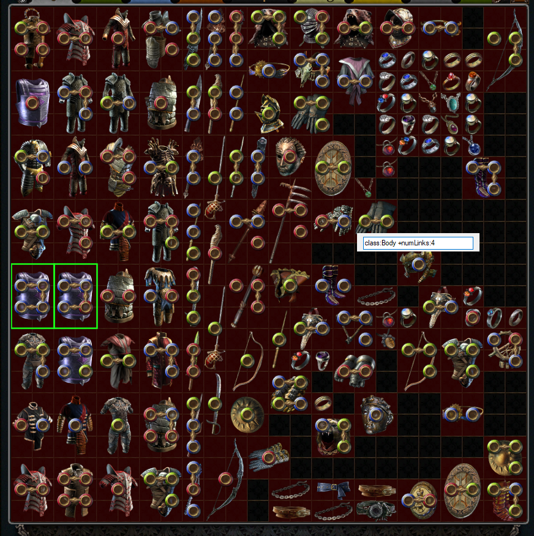
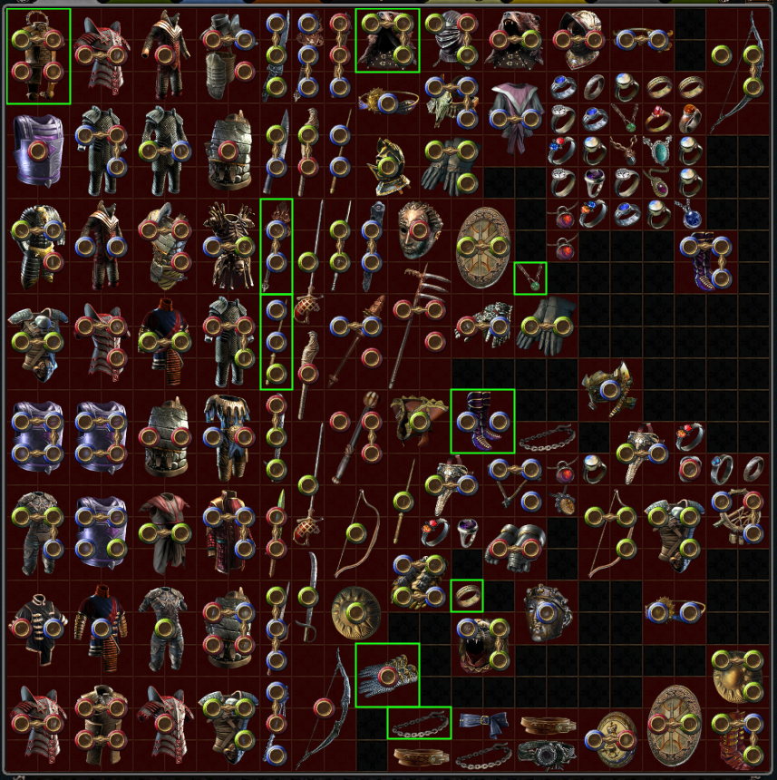

# stashvision


Stashvision is a proof-of-concept private stash indexing tool and
overlay for [Path of Exile][1].

## Rationale

Having more robust stash searching in Path of Exile, while definitely a
beneficial feature, was not the original motivation for **Stashvision**.
The pain and time sink of organizing and optimizing item collection and
vendoring for the [chaos recipe][2] was.

Naive stash searching is definitely something many have complained about
over the years, however, with few solutions other than just dealing with
it until GGG develops more powerful searching functionality.
For example, searching for `gloves` will not highlight
`Assassin's Mitts`, despite them being gloves. Searching for items with
a specific number of sockets or linked sockets is also impossible, among
other properties.

A number of open source tools exist for searching the stash locally,
outside of the game, but it's just as painful having to lookup the item
position in-game.

Thus, **Stashvision** provides a stash tab item indexing framework and
CLI utility for indexing, querying, and recipe scanning your private
stash tabs, _as well as_ an AutoHotkey-based overlay that highlights the
items at the press of a hotkey.

**No auto-clicking is involved, so Stashvision should be 100% ToS
compliant.**

## Features

* Private stash tab indexing and full-text search (powered by [Bleve][3]).
* Customizable stash tab item highlighting for search results and recipes.
* Portable as heck, the user is not expected to install any developer
  frameworks or runtimes other than [AutoHotkey][4], which many PoE players
  have installed regardless for [PoE-TradeMacro][5].
* Non-intrusive to the game client. Completely hotkey-driven, and
  absolutely no auto-clicking.

## Caveats

* Avoid manipulating your stash tabs (or at least the one being scanned)
  excessively, as updates are nowhere close to real-time. For chaos
  recipes, the ideal workflow would be to start with a full quad tab,
  highlight the recipe, move items from the stash to your inventory,
  vendor, cycle to the next set of items, rinse and repeat, all without
  moving any items around, or adding new ones to the stash tab.
* The overlay only works if your game is running in windowed borderless
  mode. The language will also likely need to be set to English, much
  like PoE-TradeMacro and other tools that consume PoE's stash API.

## Screenshots




## Quickstart

1. Download the **current version** of [AutoHotkey][4] (not V2).
2. Download and extract the [latest release][6] of **Stashvision**.
3. Copy `stashvision.ini.example` to `stashvision.ini`, and fill in your
   POESESSID, account name, and any other desired configuration.
3. Run `stashvision.ahk`.

**Note:** Ensure your game client is running in *borderless mode*, and
the language is set to *English*.

## Default Hotkeys

**shift + alt + c**:
    Highlight chaos recipe in configured stash tab. Subsequent triggers
    will cycle through multiple recipe item sets. After all sets have
    been cycled through, a new index scan will occur.

**shift + alt + s**:
    Search and highlight items in configured stash tab.

**escape**:
    Close the overlay or search window.

## Configuration (``stashvision.ini``)

#### Account settings

```ini
[General]
SessionId = xxx
AccountName = xxx
```

**SessionId** is your **POESESSID**.

### Stash settings

```ini
[Stash]
DumpTabIndex = 0
DumpTabQuad = true
```

Currently, Stashvision only supports searching and highlighting one tab
at a time.

### Display

```ini
[Display]
DefaultHighlightBorder = 0xff1aff1a
```

Expected color code format is AARRGGBB.

### Hotkeys

```ini
[Bindings]
ChaosRecipe = +!c
Search = +!s
```

See AutoHotkey's documentation on [hotkey modifier symbols][7] for more
information.

## Indexer application

**Stashvision** provides a Golang-based indexer application that can be
invoked separately from the AutoHotkey script, to manually manage a
local index, search for items, or scan a stash index for sets of items
that meet vendor recipe criteria.

```
$ ./stashvision.exe
stashvision - Index and analyze your Path of Exile stash.

commands:
  q, query     query stash items index
  r, recipe    evaluate recipes against index
  s, server    run stash indexing server

usage:
  stashvision query [--json] -s=<querystring>
  stashvision server -s=<poesessionid> -a=<account_name>

arguments:
  --help             show this screen
  --version          show version

```

## Search

See [Bleve's query string syntax][3] for specifics about query string
format. Features at a glance include:

* Boolean queries (prefix items with `+` or `-`)
* Phrase queries (quote phrases with double quotes)
* Numeric queries (e.g. `field:>8`, `field:<=9`, or `field:10`)

In addition to robust searching capability, **Stashvision** adds a
number of fields to item metadata that are not easily searchable
in-game.

**Note:** Due to shortcomings of the indexing library used, Stashvision
stores boolean fields as integers. So a query string for
`identified:true` should actually be `identified:1`.

### Fields

```
class
corrupted
frameType
h
icon
id
identified
ilvl
inventoryId
league
name
numLinks
numSockets
properties
tabIndex
typeLine
verified
w
x
y
```

### Convenience fields

**class**:
    The class name of an item, e.g. *Gloves*, *Body Armour*, or *Boots*.

**numSockets**:
    The total number of sockets on an item.

**numLinks**:
    The name is a bit of a misnomer, as this is really just the *maximum
    number of links across all socket groups*.


## Roadmap

In no particular order...

* OAuth
* Multiple stash tab support
* Detect in-game stash tab state non-intrusively
* More vendor recipe support
* Total potential chaos recipe reward displayed as another overlay


[1]: http://pathofexile.com/
[2]: https://pathofexile.gamepedia.com/Vendor_recipe_system#Full_Rare_Sets
[3]: https://blevesearch.com/docs/Query-String-Query/
[4]: https://www.autohotkey.com/
[5]: https://poe-trademacro.github.io
[6]: https://github.com/darvid/stashvision/releases/latest
[7]: https://www.autohotkey.com/docs/Hotkeys.htm#Symbols
